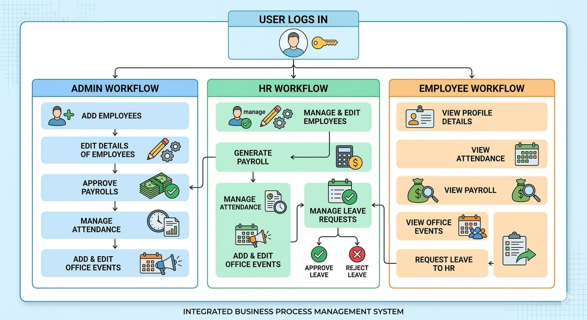

# 💼 Payroll Management System (ASP.NET Core MVC)

An **Enterprise-Level Payroll Management System** built using **ASP.NET Core MVC** and **Entity Framework Core (Code First Approach)**.
This system helps organizations efficiently manage **employees, attendance, payroll processing, leave management, and notifications**.

---

## 📊 System Workflow Overview



> The system supports **Admin, HR, and Employee workflows** with role-based access and operations.

---

# 🚀 Features

## 🔹 Admin Module

* Add / Edit / Delete Employees
* Approve Payrolls
* Manage Attendance
* Manage Office Events
* Send Notifications

## 🔹 HR Module

* Manage Employee Records
* Generate Payroll
* Track Attendance
* Approve / Reject Leave Requests

## 🔹 Employee Module

* View Profile Details
* View Attendance
* View Payroll (Payslip)
* Apply for Leave
* Receive Notifications

---

# 🏗️ System Architecture

## 🔹 Architecture Layers

1. **Presentation Layer**

   * ASP.NET Core MVC Views
   * Razor Pages
   * Bootstrap UI

2. **Application Layer**

   * Controllers
   * Business Logic
   * Validation

3. **Data Access Layer**

   * Entity Framework Core
   * DbContext
   * LINQ Queries

4. **Database Layer**

   * SQL Server
   * Code First Generated Tables

---

## 🔁 Architecture Flow

```
User (Admin / HR / Employee)
        ↓
ASP.NET MVC Views
        ↓
Controllers
        ↓
Business Logic
        ↓
Entity Framework Core
        ↓
SQL Server Database
```

---

# 🧩 Entity Relationship Overview

## 📌 Entities

* Employees
* Attendances
* Payrolls
* LeaveRequests
* Notifications
* EmployeeNotifications
* AspNetUsers (Identity)

## 🔗 Relationships

* One Employee → Many Attendances
* One Employee → Many Payrolls
* One Employee → Many Leave Requests
* Notifications → Many Employees

---

# ⚙️ Tech Stack

| Technology            | Purpose                |
| --------------------- | ---------------------- |
| ASP.NET Core MVC      | Web Framework          |
| Entity Framework Core | ORM                    |
| SQL Server            | Database               |
| Identity Framework    | Authentication & Roles |
| Bootstrap             | UI Design              |

---

# 🛠️ Project Setup (Code First Approach)

## 1️⃣ Create Project

* ASP.NET Core MVC
* .NET 6 / .NET 7
* Authentication: Individual Accounts

---

## 2️⃣ Install Packages

```
Microsoft.EntityFrameworkCore.SqlServer
Microsoft.EntityFrameworkCore.Tools
Microsoft.EntityFrameworkCore.Design
Microsoft.AspNetCore.Identity.EntityFrameworkCore
```

---

## 3️⃣ Create Models

Entities:

* Employees
* Attendances
* Payrolls
* LeaveRequest
* Notifications
* EmployeeNotifications

---

## 4️⃣ DbContext

```csharp
public class PayrollDbContext : IdentityDbContext
{
    public PayrollDbContext(DbContextOptions<PayrollDbContext> options)
        : base(options) {}

    public DbSet<Employees> Employees { get; set; }
    public DbSet<Attendances> Attendances { get; set; }
    public DbSet<Payrolls> Payrolls { get; set; }
    public DbSet<LeaveRequest> LeaveRequests { get; set; }
    public DbSet<Notifications> Notifications { get; set; }
    public DbSet<EmployeeNotifications> EmployeeNotifications { get; set; }
}
```

---

## 5️⃣ Connection String

```json
"ConnectionStrings": {
  "DefaultConnection": "Server=DESKTOP-XXXX;Database=PayrollDB_Main;Trusted_Connection=True;Encrypt=False"
}
```

---

## 6️⃣ Register DbContext

```csharp
builder.Services.AddDbContext<PayrollDbContext>(options =>
    options.UseSqlServer(builder.Configuration.GetConnectionString("DefaultConnection")));
```

---

## 7️⃣ Migration Commands

```bash
Add-Migration InitialCreate
Update-Database
```

---

## 8️⃣ Run Project

```bash
dotnet clean
dotnet build
dotnet run
```

👉 Runs on: `https://localhost:xxxx`

---

# 🔐 Authentication & Roles

* ASP.NET Identity Integration
* Roles:

  * Admin
  * HR
  * Employee

---

# 📌 Business Logic

## 💰 Payroll Calculation

```
Net Salary = Gross Salary - Deductions
```

## 📅 Attendance Tracking

* Daily attendance recording

## 📝 Leave Management

* Apply / Approve / Reject workflow

## 🔔 Notifications

* Admin → Employee communication system

---

# 📊 Database Tables

| Table                 | Purpose              |
| --------------------- | -------------------- |
| Employees             | Employee details     |
| Attendances           | Attendance tracking  |
| Payrolls              | Salary records       |
| LeaveRequests         | Leave applications   |
| Notifications         | System notifications |
| EmployeeNotifications | Notification mapping |

---

# 📈 Advantages

* ✔ Automated payroll processing
* ✔ Reduces manual errors
* ✔ Role-based secure system
* ✔ Scalable architecture
* ✔ Code First flexibility

---

# 🔮 Future Enhancements

* Azure Cloud Deployment
* Email Notifications
* Biometric Attendance
* Mobile Application

---

# 📌 Conclusion

This project demonstrates a **real-world enterprise application** using:

* ASP.NET Core MVC
* Entity Framework Core (Code First)
* SQL Server

It provides a **complete HR and Payroll solution** with scalable architecture and clean design.

---

# 👨‍💻 Author

**Bandi Bharath Kumar**

---

⭐ If you like this project, give it a star on GitHub!
